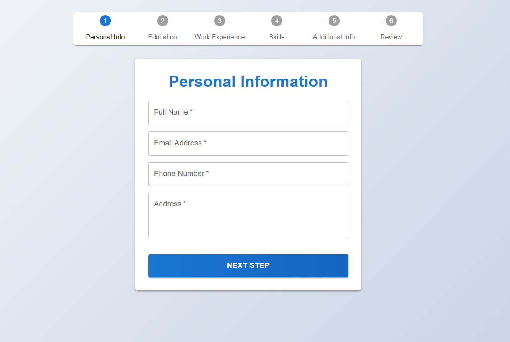
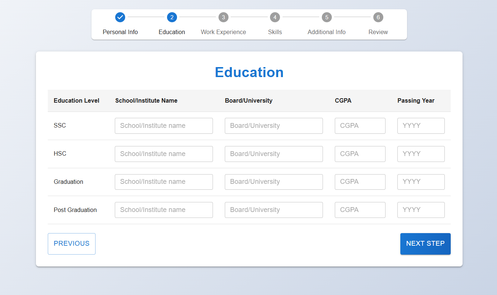
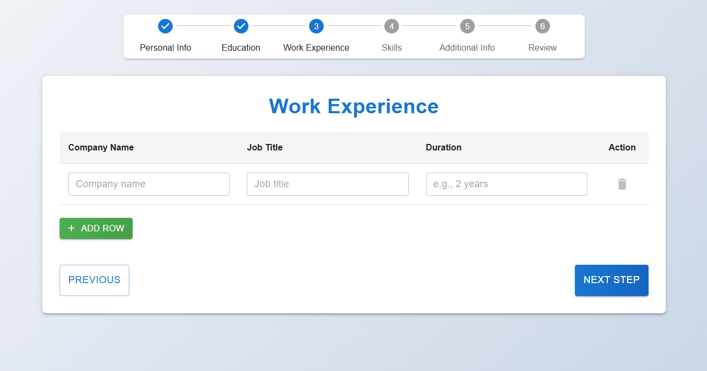
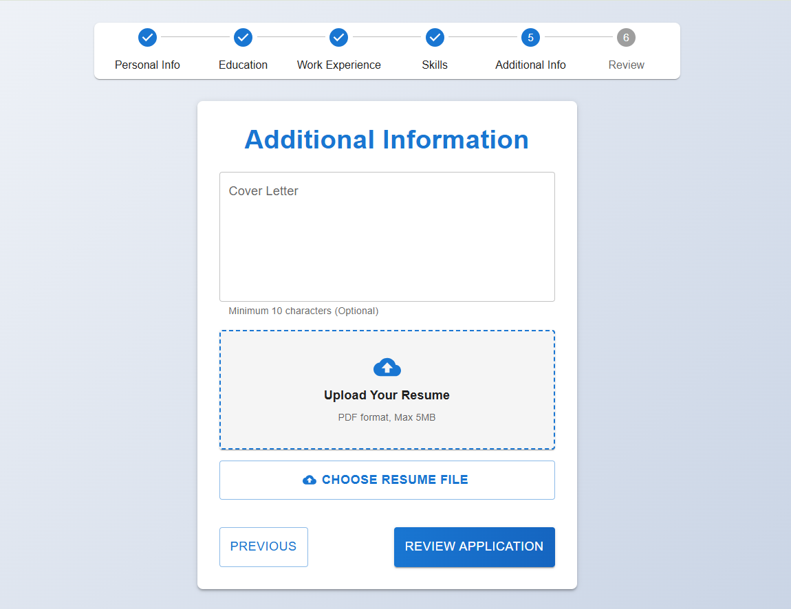
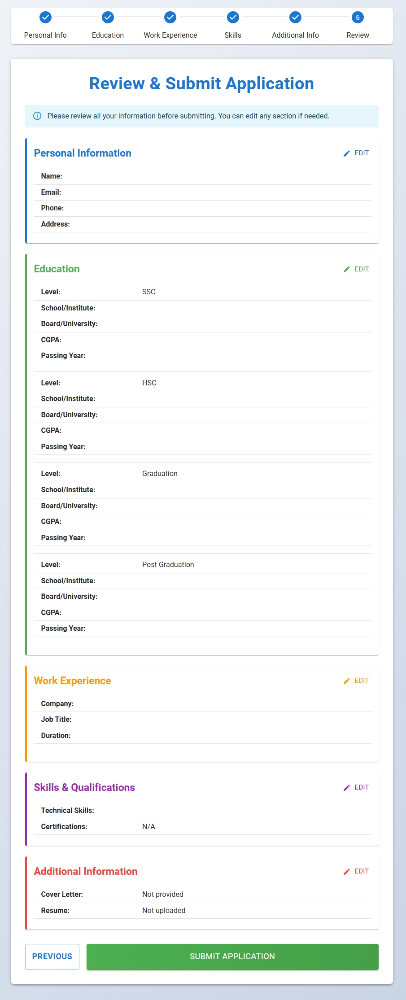

# Job Application Form

A multi-step job application form built with React, React Router, Redux Toolkit, React Hook Form, Material UI, and Vite.

## Overview

This app guides users through a job application workflow with separate sections for:

- Personal information
- Education history
- Work experience
- Skills
- Additional information
- Review and submission

It validates input at each step and preserves data as the user moves between pages.

## Screenshots













## Features

- Multi-step form wizard
- Persistent form state using Redux Toolkit
- Form validation with React Hook Form
- Responsive Material UI layout
- Dynamic input fields for multiple education and experience entries
- Review page before final submission

## Tech Stack

- React JS
- Vite
- Material UI
- React Router DOM
- Redux Toolkit
- React Hook Form

## Getting Started

### Install dependencies

```bash
npm install
```

### Run Project

```bash
npm run dev
```

## Project Structure

- `src/App.jsx` - root app component with routing
- `src/main.jsx` - app entry point
- `src/components/` - page components for each form step
- `src/redux/` - Redux store and form slice
- `src/utils/validationRules.js` - validation logic for form fields
- `src/assets/` - image and icon assets used in the README and app
